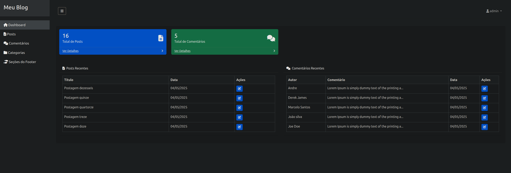

[🇧🇷 Versão em Português](README.md)

# Personal Blog in PHP

This is a personal blog project developed in PHP, featuring an admin panel, posts, categories, comments, search, and a responsive layout using Bootstrap 5.

## Before Refactoring
- The project used duplicate includes and connections, making maintenance difficult.
- Configurations were scattered across several files, with fixed and non-portable paths.
- There were recurring issues with undefined variables, conflicting includes, and duplicate methods.
- The admin panel and front-end had integration and dynamic information display issues.
- The code was not easily portable to other environments (localhost, production, subfolder, etc).

## After Refactoring
- **Centralized configuration**: All settings and connections are in `config.php`.
- **Global base URL variable**: The project is now portable to any environment, just adjust `config.php`.
- **Standardized includes**: All files use `require_once 'config.php'` to ensure variables and connections.
- **Optimized classes**: Methods in the `Post` and `Comment` classes have been fixed and standardized.
- **Clear messages and feedback**: All admin and front-end actions display user-friendly messages.
- **Responsive layout**: Bootstrap 5 is used throughout the system.
- **Removal of unnecessary files**: Old scripts and SQLs removed, database backup centralized in the `database` folder.
- **Dynamic links**: All important links use the base URL, making deployment on any server easier.

## How to Run the Project

1. **Clone the repository:**
   ```bash
   git clone https://github.com/seuusuario/blog.version1.git
   ```
2. **Set up the environment:**
   - PHP 7.4+
   - MySQL/MariaDB
   - Web server (Apache, Nginx, XAMPP, etc)
3. **Import the database:**
   - In phpMyAdmin or via terminal, import the file `database/blog.sql` (or your backup file) to create the tables and initial data.
4. **Configure the `config.php` file if needed:**
   - Adjust the user, password, and database name according to your environment.
   - The base URL is detected automatically, but can be set manually if needed.
5. **Access the system:**
   - Front-end: `http://localhost/blog.version1/`
   - Admin: `http://localhost/blog.version1/admin/login.php`

## Folder Structure

- `admin/` — Admin panel
- `includes/` — Classes, functions, and shared layouts
- `uploads/` — Post images
- `screenshots/` — System screenshots
- `database/` — Database backup

## System Screenshots

### Front-end


### Admin Panel




## Main Refactoring Improvements
- Centralized configuration and connection
- Full project portability
- Fixed bugs with includes, variables, and methods
- Cleaner and more responsive layout
- Clear feedback messages for the user
- Code easier to maintain and evolve

---

**Project refactored and documented by Robson Luiz.** 