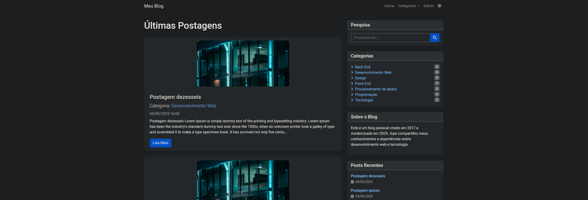
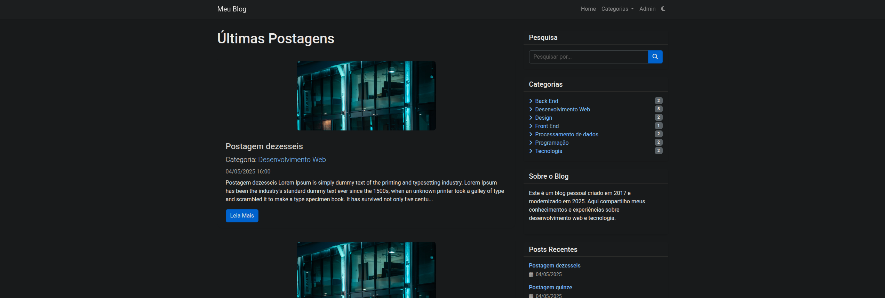
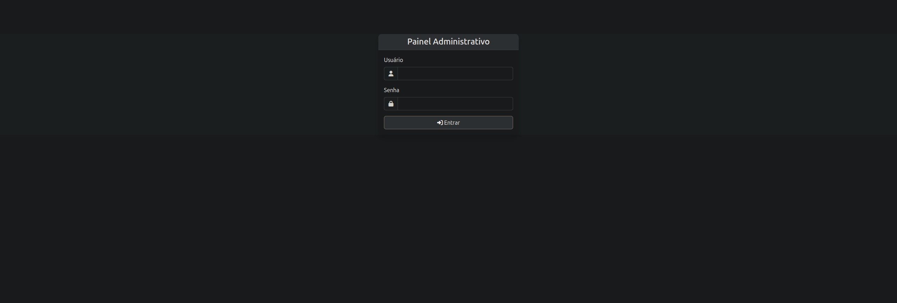
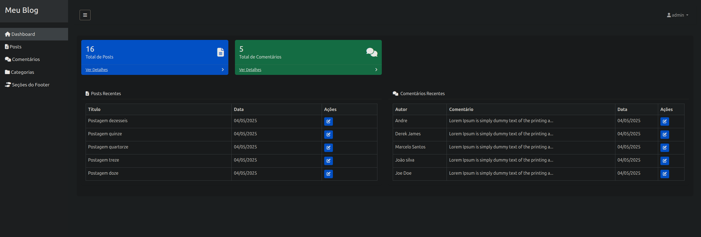

[🇺🇸 English version](README.en.md)

# Blog Pessoal em PHP

Este é um projeto de blog pessoal desenvolvido em PHP, com painel administrativo, sistema de posts, categorias, comentários, busca, e layout responsivo usando Bootstrap 5.

## Antes da Refatoração
- O projeto utilizava includes e conexões duplicadas, dificultando a manutenção.
- As configurações estavam espalhadas em vários arquivos, com caminhos fixos e pouco portáveis.
- Havia problemas recorrentes de variáveis indefinidas, includes conflitantes e métodos duplicados.
- O painel administrativo e o front-end tinham problemas de integração e exibição de informações dinâmicas.
- O código não era facilmente portável para outros ambientes (localhost, produção, subpasta, etc).

## Depois da Refatoração
- **Centralização das configurações**: Todas as configurações e conexões estão no `config.php`.
- **Variável global de base URL**: Agora o projeto é portável para qualquer ambiente, basta ajustar o `config.php`.
- **Includes padronizados**: Todos os arquivos usam `require_once 'config.php'` para garantir variáveis e conexões.
- **Classes otimizadas**: Métodos das classes `Post` e `Comment` corrigidos e padronizados.
- **Mensagens e feedbacks claros**: Todas as ações do admin e do front-end exibem mensagens amigáveis.
- **Layout responsivo**: Utilização do Bootstrap 5 em todo o sistema.
- **Exclusão de arquivos desnecessários**: Scripts e SQLs antigos removidos, backup do banco centralizado na pasta `database`.
- **Links dinâmicos**: Todos os links importantes usam a base URL, facilitando deploy em qualquer servidor.

## Como rodar o projeto

1. **Clone o repositório:**
   ```bash
   git clone https://github.com/robson-luiz/blog-pessoal-php.git
   ```
2. **Configure o ambiente:**
   - PHP 7.4+
   - MySQL/MariaDB
   - Servidor web (Apache, Nginx, XAMPP, etc)
3. **Importe o banco de dados:**
   - No phpMyAdmin ou via terminal, importe o arquivo `database/cms.sql` para criar as tabelas e dados iniciais.
4. **Configure o arquivo `config.php` se necessário:**
   - Ajuste usuário, senha e nome do banco conforme seu ambiente.
   - A base URL é detectada automaticamente, mas pode ser ajustada manualmente se necessário.
5. **Acesse o sistema:**
   - Front-end: `http://localhost/blog-pessoal-php/`
   - Admin: `http://localhost/blog-pessoal-php/admin/login.php`

## Estrutura de Pastas

- `admin/` — Painel administrativo
- `includes/` — Classes, funções e layouts compartilhados
- `uploads/` — Imagens dos posts
- `screenshots/` — Prints das telas do sistema
- `database/` — Backup do banco de dados

## Prints do Sistema

### Front-end





### Administrativo





## Principais Melhorias da Refatoração
- Centralização de configuração e conexão
- Portabilidade total do projeto
- Correção de bugs de includes, variáveis e métodos
- Layout mais limpo e responsivo
- Mensagens de feedback claras para o usuário
- Código mais fácil de manter e evoluir

---

**Projeto refatorado e documentado por Robson Luiz.**
